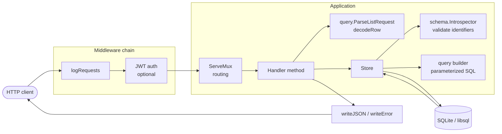
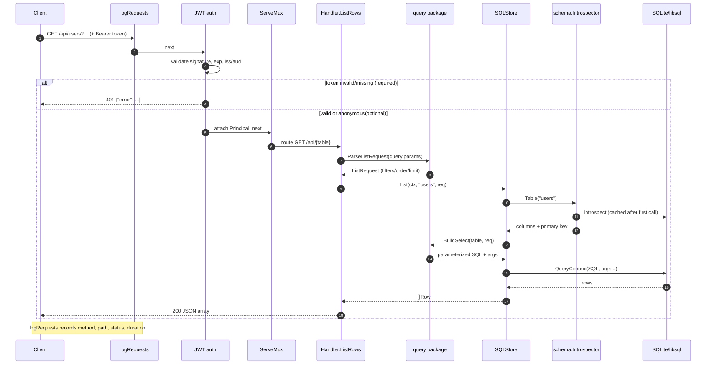
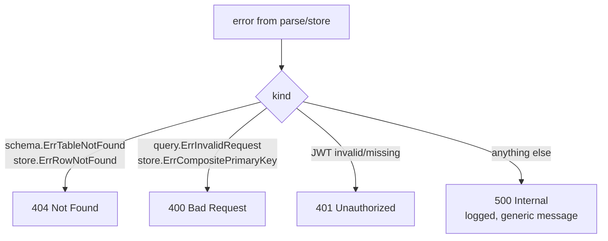

# Request flow

How an HTTP request travels through libsql-rest, from the socket to SQLite/libsql
and back. Every request passes through the same middleware and layering; the
endpoint only changes which handler and which `Store` method run.

Rendered images (for viewers without Mermaid support):
[layers](images/request-flow-layers.png) ·
[sequence](images/request-flow-sequence.png)

## Layers

- **logRequests** is always outermost, so even `401`s are logged.
- **JWT auth** is present only when `auth.enabled`. It validates the bearer token
  and attaches an `*auth.Principal` to the request context (anonymous when
  `auth.optional` and no token is supplied). This is the seam RLS will read.
- **Store** is an interface; the SQL implementation validates every table/column
  against the introspected schema and binds all values as `?` parameters.

## Request lifecycle (list with a filter)

`GET /api/users?age=gte.18&order=age.desc&limit=20` with `Authorization: Bearer <jwt>`

## Endpoint reference

| Method & path | Handler | Store call | Success | Body in | Body out |
| --- | --- | --- | --- | --- | --- |
| `GET /openapi.json` | `OpenAPI` | `Schema` | `200` | – | OpenAPI 3.0 document |
| `GET /api/tables` | `ListTables` | `Tables` | `200` | – | `[{name,type}]` |
| `GET /api/{table}` | `ListRows` | `List` | `200` | – | `[{...row}]` |
| `GET /api/{table}/{pk}` | `GetRow` | `Get` | `200` | – | `{...row}` |
| `POST /api/{table}` | `CreateRow` | `Insert` | `201` | `{...row}` | `{...row}` (with defaults) |
| `PATCH /api/{table}/{pk}` | `UpdateRow` | `Update` | `200` | `{...partial}` | `{...row}` |
| `DELETE /api/{table}/{pk}` | `DeleteRow` | `Delete` | `204` | – | – |

`{table}` accepts any exposed table or view; `{pk}` is matched against the
table's single-column primary key (falling back to `rowid`).

### List query parameters (`GET /api/{table}`)

- Filters: `column=op.value` (`eq,neq,gt,gte,lt,lte,like,ilike,in,is`), `not.` to negate
- `select=col1,col2` — projection
- `order=col.asc,col2.desc[.nullsfirst|.nullslast]`
- `limit` / `offset` — paging (`limit` capped by `max_page_size`)

## Error mapping

Every error is a `{"error": "message"}` envelope. The status is derived centrally
in `writeStoreError`:

Disallowed tables (outside `allow_tables`) are reported as `404`, so the allow
list never leaks the existence of hidden tables.
